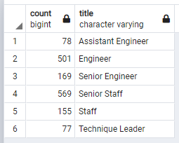

# Pewlett-Hackard-Analysis
# Pewlett Hackard Employee Turnover Risk Assessment and Mitigation: Supplemental Work
## Overview of Analysis
#### Prior Work
A prior analysis was performed to assess the risk of an excessive employee turnover rate in the future due to a high percentage of employees approaching retirement eligibility and the associated loss of skill, knowledge, and expertise that could potentially occur with such a spike in turnover. Mitigation steps were developed by another group and not reported here.
#### Supplemental Work
Some supplemental work was requested involving 
1) the determination of the number of potential near-term retiring employees, and 
2) the identification of employees who may be eligible to participate in a mentorship program to assist in skills/knowledge transfer. 
## Results
-	**The number employees retiring in most positions is very large:** (See Chart below.)
-	
-	**Senior technical positions are poised to take the biggest hit:** As can be seen above, Senior Engineer and Senior Staff positions represent the largest component of potential near-term retirees.
-	**The exception to this is managers:** Only two management positions will need to be filled in the near-term.
-	**The number of potential mentors is relatively small compared to the number of potential trainees:** (See Chart below and Summary for details.)
- 
## Summary
1)	A total of 90398 roles will need to be filled in the near term to replace retiring employees.
2)	The ratios of potential staff requiring mentoring (grouped by title) to available mentors ranges from 22 to 1 all the way to 174 to 1. (See Chart below.)
- 

